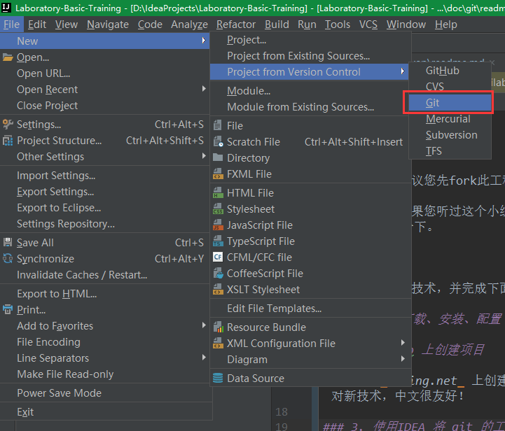
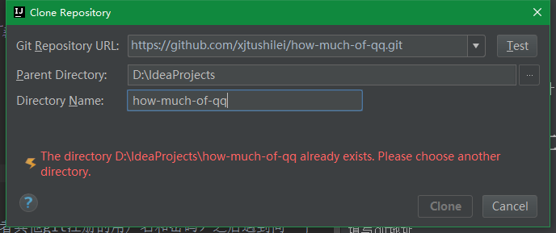

# git

这里是git的学习以及了解！

在学习之前，建议您先fork此工程！

这开始之间，如果您听过这个小组分享[TeamShare-Git.pdf](TeamShare-Git.pdf),可以先回忆一下。

# 任务列表

请自行搜索相关技术，并完成下面的任务

### 1. git 下载、安装、配置

### 2. github 上创建项目

推荐您在 _coding.net_ 上创建第一个项目，查看项目具有什么功能和操作！因为面对新技术，中文很友好！

### 3. 使用IDEA 将 git 的工程下载到本地

选择git

填写git地址

然后提示输入账号密码。（github或者其他git注册的用户名和密码）之后遇到同一个git不同项目也不用再次输入密码。

clone到本地

### 4. 提交新的

这一步，请先搜索`.gitignore`进行学习相关知识！

进行文本文件（txt、md、java、py等）创建，修改，删除等。然后重新提交工程！

# 深刻理解

> 到这里之前，东西已经够基本使用，然而还是推荐继续走下去。

之前，您仅仅是入门了，现在要做的是。

阅读[廖雪峰](http://www.liaoxuefeng.com/)的网站提供的git教程，深刻理解分支、merge、push、pull等概念。