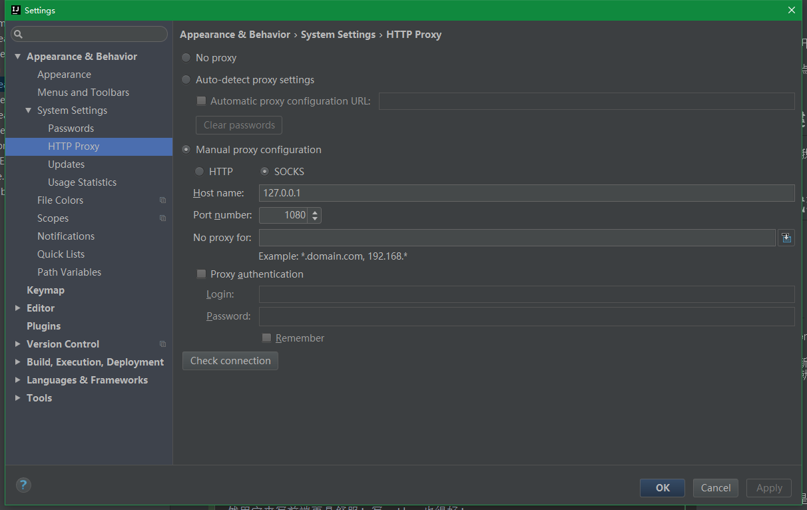

[TOC]

这里是全篇学习的开始。

良好的基础是学习进步的阶梯！

顺手的工具是强大的生产力！

# IDEA

java不用ide，真的是浪费时间和精力，即便再大的神也推荐用。

IDEA可以默认写java、xml、js、html、css、md、json等等，java技术栈支持特别友好！

## 渊源

个人是一个资深的eclipse使用者，在使用过几次后，慢慢的接收，并深爱上它。

如果你也是Eclipse使用者，请读并接受IDEA，如果还不够，请强迫自己使用1个项目！

- [为何 IntelliJ IDEA 比 Eclipse 更好](http://www.oschina.net/news/26929/why-intellij-is-better-than-eclipse)
- [IntelliJ IDEA 好用在哪里?](https://www.zhihu.com/question/23648034)

除此之外，我喜欢的原因：

- 支持各种文件：java、md、html、js、xml、json等，而Eclipse支持很不友好，以至于之前会试用其他工具，比如sublime。
- 更新及时：每隔几星期就有几兆的更新，学习苹果的定时推送，而不是微软之前的大版本更新（微软win10最近也在学习苹果这样模式的更新）
- 默认友好的支持最新先进的工具、接地气：eclipse居然默认不支持gradle，spring等，这也是eclipse落寞的原因
- 友好的版本控制：比eclipse舒服多了。
- 不卡！第一次打开有点慢，至少比eclipse快，之后还没卡过。在我32G内存并给eclipse的JVM增加内存的情况下，eclipse不仅打开慢，而且用着就卡了，经常出现不能复制粘贴，取消任务直接卡死，只能重启。
- 丰富的插件！安装简单，不像eclipse那样架构的麻烦！

不舒服的地方：
- 一个窗口只能打开一个项目，现在已经很习惯了。eclipse多项目确实爽
- maven pom写了一半，不用保存就会update。或许我配置不好，改天再看看。

## IDEA 安装

官网下载 ！ 推荐`Ultimate`版本，需要license请email至`xjtushilei@foxmail.com`

安装之前，请先安装jdk（推荐最新版jdk8, jdk9快发布了，鄙视1.7版本以下的，建议官网下载！并安装到默认目录！）环境配置，请严格按照[JDK安装与环境变量配置](http://jingyan.baidu.com/article/6dad5075d1dc40a123e36ea3.html)进行配置。提示：在环境变量中的path中增加东西时候，请尽量放在前面，而不是path最后，因为你会遇到不可预知的bug（比如自己安装的命名是jdk8，测试却是jdk7）

如果没有购买license，可以之后再注册，先试用。

## IDEA熟悉

设置的熟悉，自己点开多看一下。并打开自动补全（默认只有首字母自动补全），调整字体，主题等。

多创建几个工程！写点东西试试。

## IDEA快捷键

<a href='http://xjtushilei.com/wiki/idea/' target='_blank'>IDEA 十大快捷键</a>是我博客的一篇wiki，可以参考。

## IDEA网络代理

如图，在设置的这里，写上你的shadowsocks代理，全局代理，这样在更新版本，push到github时候，速度上M。

# pycharm

如果你是一个pythoner，请下载pycharm，或者idea加一个插件就可以了。但是我还是推荐写python用pycharm。项目管理，代码提示和包管理等不适普通的编辑器能比的。缺点是没有sublime、notepad++等轻量级。

如果你是一个python新手，建议您先安装 python 3.5，并在[廖雪峰](http://www.liaoxuefeng.com/)的网站进行学习python ！ 不然你会在编码这块就失去了对python的热爱。

# Sublime

轻量级的文本编辑器，首推这个。平时简单的修改代码，或者查看文本文件等等。当然用它来写前端更是舒服！写python也很好！

相对于VSCode（也是轻量级的）速度更快，格式更优美，编码更省心。

推荐sublime3，并推荐下载已经集成常用的插件的绿色版，亦可下载绿色版自己安装插件。因为绿色版在放到另一个电脑上上，各种自己的个性化配置不用重新配置。

