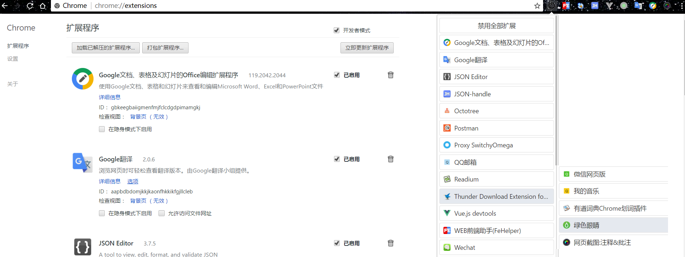

> 这里是打开新世界的大门。

> 推荐使用SSR客户端，在最后，刚开始推荐的ss，已经被国家大规模和谐，据说研究出了最新的干扰算法。

# 客户端
### Windows

首推[windows版本](https://github.com/shadowsocks/shadowsocks-windows)

查看[shadowsocks中文wiki](https://github.com/shadowsocks/shadowsocks-windows/wiki/Shadowsocks-Windows-%E4%BD%BF%E7%94%A8%E8%AF%B4%E6%98%8E)

### Linux and MacOS 

如果你使用其他版本，可以查看

各种操作系统版本[https://github.com/shadowsocks/shadowsocks-gui](https://github.com/shadowsocks/shadowsocks-gui)

# 账户

### 牛力ss

推荐[牛力ss](https://my.niuliss.com)
 
不知道需要翻墙才能登陆否。推荐购买最低的年费版本，年付28RMB。每月限10G，足够用，速度几兆没压力。土豪看视频的另说。

不限流量的ss套餐大多速度不够快，而且限制多人登陆。限制流量的可以无线设备登陆，手机也可以下载ss(app不叫shadowsocks)

### 免费体验

[ishadow](https://ishadow.404da.com/index_cn.html)获取账号,或者自己百度

### 其他

自己在google上搜索shadowsocks服务提供。百度和bing等都不提供搜索服务，有搜索商和zf有合作关系。

### 免费账户

免费的服务质量不是很好，不稳定，关键时刻速度10k/s。google能找到一定的免费提供商。

还有，我们推荐您用海外的linux服务器，自己搭建一个ss服务器。tips：亚马逊学生免费试用一年（2016年可用）。

# 浏览器

浏览器，是我们之后学习很重要的一部分，所以这部分也要认真对待。

### Google chrome

没有其他选择，首推`google浏览器`。如果你是Firefox忠实用户，推荐您转到Chrome.

自己注册一个账号，方便同步书签、插件、密码管理、cookie同步等等。

### Chrome插件

我这里推荐几个，如下图



插件功能，百度或者在google商店里搜索查看吧。

其中跟本帖有关的插件，注意`SwitchyOmega`是我们关注的，用来将谷歌浏览器的代理，换成这个软件，十分方便。这里给出我的设置文件(本目录的 [**OmegaOptions.bak**](OmegaOptions.bak)文件，自行下载)，可以在设置中直接导入恢复。自己平时使用的时候，可以直接点击图标添加规则，来构建自己的规则列表。

有些前端的插件，是我们之后学习使用的，推荐都尝试一下这些插件。也可以自己寻找有意思的插件，或者尝试google OS。

### 360安全浏览器

然后是`360安全浏览器`，可以用ie兼容模式用来打开古老的网站，比如选课系统。同时可以用来测试自己的网页的ie兼容性。


# SSR技术 免费账号

### 客户端

在 github 上下载，https://github.com/shadowsocksr/shadowsocksr-csharp，内容已经没了，但是在releases里可以看到最新的更新客户端。这样可以防和谐。

### 免费账号获取方法

https://plus.google.com/communities/104092405342699579599

然后找到这样的东西 

```
ssr://NDUuMzIuMTkuMjUxOjQ0MzphdXRoX2FlczEyOF9tZDU6YWVzL
TI1Ni1jZmI6dGxzMS4yX3RpY2tldF9hdXRoOk1USXpORFUvP29iZnNw
YXJhbT0mcHJvdG9wYXJhbT0mcmVtYXJrcz1WblZzZEhJdFZHOXJlVzh
vTlRBd1ItYTFnZW1Iai1lVXFPV3VqT2FJbHVpQWhlV0lzT1M0Z09TNH
F1YWNpT2FYdHVtWHRPV3dzVVJsYkNrbzVhLUc1NkNCTVRJek5EVXBLT1
dJcS1hN3BlZVVxQ2smZ3JvdXA9
```

直接在ssr客户端里添加上就可以了。

或者自己谷歌“ssr免费账号”，应该有好多网站都提供！这里附上一个：https://doub.io/sszhfx/ ，

当然也可以在“谷歌群组”里，购买付费的，这样相对稳定。


### 提醒

所有相关的搜索，请使用谷歌搜索。

所有相关的账号分享网站，一定是翻墙才能上的。